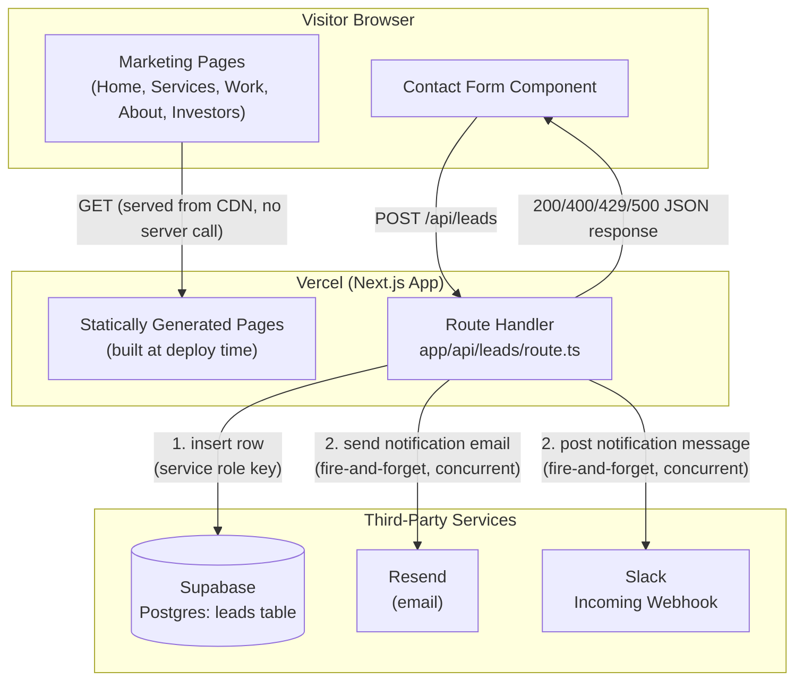
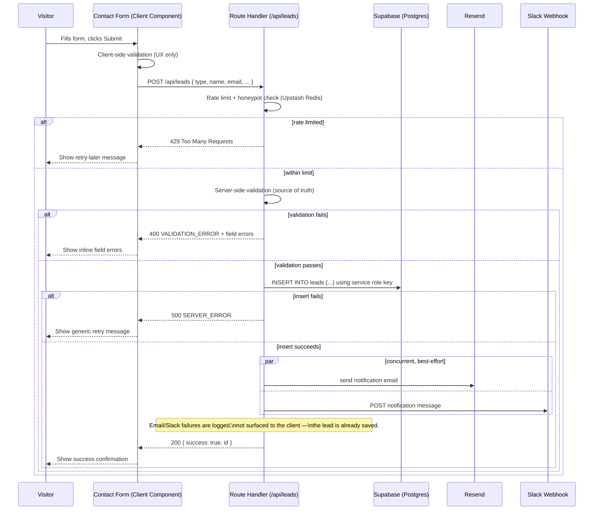
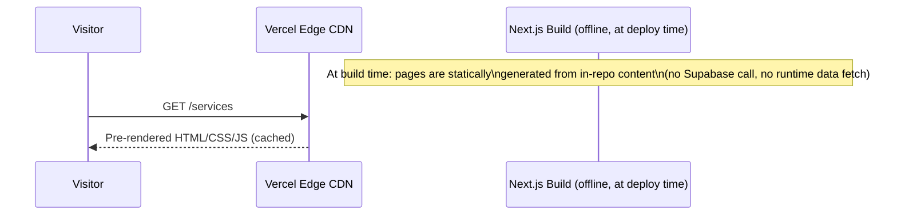

# Jarvis Studios Website Rebuild — Architecture Document

**Status:** Draft
**Input:** [[PRD]] · [[TRD]]
**Related:** [[DESIGN]] · [[SECURITY_AUDIT]]
**Last updated:** 2026-08-02

---

## 1. Stack Confirmation

This document is consistent with the PRD and TRD: **Next.js + Supabase**, no Express server, no MongoDB. There is no standalone Node backend process — server-side logic that needs secrets lives in Next.js Route Handlers, which run as Vercel serverless/edge functions rather than a long-running Express app.

## 2. System Diagram

### 2.1 Components & data flow



### 2.2 Request lifecycle: contact form submission



### 2.3 Request lifecycle: marketing page view



Marketing pages have **no runtime dependency** on Supabase or any third-party service — this is a deliberate reliability and performance decision (see §4.2).

## 3. Folder / Module Structure

```
jarvis-studios-website/
├── app/
│   ├── layout.tsx                  # Root layout: nav, footer, global SEO defaults
│   ├── page.tsx                    # Homepage (SSG)
│   ├── globals.css                 # Tailwind base + design tokens
│   │
│   ├── services/
│   │   └── page.tsx                # Services page (SSG) — renders content/services.ts
│   │
│   ├── work/
│   │   └── page.tsx                # Portfolio/case studies page (SSG)
│   │
│   ├── about/
│   │   └── page.tsx                # About page (SSG)
│   │
│   ├── investors/
│   │   └── page.tsx                # Investor/partner page (SSG)
│   │
│   ├── contact/
│   │   └── page.tsx                # Contact page — renders <ContactForm />
│   │
│   ├── api/
│   │   └── leads/
│   │       └── route.ts            # POST handler — the only API endpoint (TRD §5)
│   │
│   ├── sitemap.ts                  # Generated sitemap.xml (TRD §8.5)
│   ├── robots.ts                   # Generated robots.txt (TRD §8.5)
│   └── not-found.tsx               # 404 page (PRD §6 item 7)
│
├── components/
│   ├── ContactForm.tsx             # Client component: form state, client-side validation, calls /api/leads
│   ├── Nav.tsx
│   ├── Footer.tsx
│   ├── ServiceCard.tsx
│   ├── CaseStudyCard.tsx
│   └── ui/                         # Low-level, reusable primitives (Button, Input, TextArea, ErrorText)
│
├── content/                        # Structured, typed content — NOT a database (TRD §8.6)
│   ├── services.ts                 # Web dev / app dev / SaaS / CRM / marketing-design copy
│   ├── case-studies.ts             # The 2 full case studies (PRD §6 item 3)
│   └── team.ts                     # About page team/bio content
│
├── lib/
│   ├── types/
│   │   └── lead.ts                 # Lead, LeadInput, LeadType, LeadStatus (TRD §4.2)
│   ├── validation/
│   │   └── lead.ts                 # Shared validation rules used by both ContactForm and route.ts
│   ├── supabase/
│   │   └── server-client.ts        # Server-only Supabase client, instantiated with service role key
│   ├── notifications/
│   │   ├── email.ts                # Resend integration (sendLeadNotificationEmail) — HTML-escapes fields before templating (security audit finding #3)
│   │   └── slack.ts                # Slack webhook integration (postLeadToSlack) — escapes mrkdwn special chars before posting (security audit finding #3)
│   ├── sanitize.ts                 # Shared escaping helpers used by both notifications/email.ts and notifications/slack.ts
│   └── rate-limit.ts               # Upstash Redis-backed rate limiting for /api/leads — NOT in-memory (security audit finding #1)
│
├── public/
│   ├── images/
│   └── favicon.ico
│
├── supabase/
│   └── migrations/
│       └── 0001_create_leads_table.sql   # DDL from TRD §4.1, checked into version control
│
├── .env.example                    # Committed, placeholder values only — documents the TRD §9 variable list
├── .env.local                      # Local-only, gitignored (and confirmed via .gitignore + GitHub push protection)
├── next.config.ts                  # Includes security response headers (CSP, HSTS, X-Frame-Options, etc. — TRD §8.1)
├── tailwind.config.ts
├── tsconfig.json
└── package.json
```

**Why no `server/` or `backend/` directory:** there is no separate backend process to house. Everything that would traditionally live in an Express app (`routes/`, `controllers/`, `middleware/`) is represented instead by `app/api/*/route.ts` files (routes/controllers) and plain functions in `lib/` (middleware-equivalent concerns like validation and rate limiting, called explicitly inside each Route Handler rather than mounted as Express middleware).

**Why `content/` instead of a `models/` + database-backed CMS:** per TRD §8.6, case study and service copy is static and versioned in the repo, not stored in Supabase. This keeps content changes as normal PRs and defers CMS investment to Phase 2 (PRD §8) without a rewrite — swapping `content/case-studies.ts` for a CMS fetch later only touches the page components that import it, not the data shape itself (same `CaseStudy` type either way).

## 4. Key Architectural Decisions

### 4.1 Route Handlers instead of a standalone Express server
**Decision:** Server-side logic (Supabase writes, Resend, Slack) lives in a single Next.js Route Handler (`app/api/leads/route.ts`), not a separate Express application.
**Rationale:** MVP has exactly one server-side operation (TRD §5). Running a second Node process (Express) alongside Next.js would mean two deployments, two sets of environment variables, and CORS configuration between them — all to serve one endpoint. A Route Handler deploys as part of the same Vercel project, shares TypeScript types with the frontend (`lib/types/lead.ts`), and scales/costs the same as the rest of the site.
**Revisit when:** the number of server-side operations grows enough (multiple resources, background jobs, webhooks from multiple external systems) that Express's routing/middleware ecosystem would meaningfully reduce boilerplate — not anticipated before Phase 2/3.

### 4.2 Static generation for all marketing pages; no runtime data fetching
**Decision:** Every page except the contact form's submission path is fully static, built at deploy time from `content/*.ts`.
**Rationale:** Directly serves TRD §7's Core Web Vitals targets (LCP < 2.5s) — static pages served from Vercel's CDN have no server round-trip and no dependency on Supabase being available. It also means a Supabase outage cannot take the marketing site itself down; only the contact form would be affected.
**Trade-off accepted:** Content edits (new case study, service copy change) require a new deployment rather than a CMS update. This is the same trade-off the PRD already made in deferring the CMS to Phase 2.

### 4.3 Supabase accessed only server-side, via service role key
**Decision:** No `NEXT_PUBLIC_SUPABASE_ANON_KEY` is used; the browser never talks to Supabase directly.
**Rationale:** MVP has no client-side reads (no page displays lead data) and the only write is the lead form submission, which already needs server-side validation regardless (TRD §5). Keeping Supabase access entirely server-side means the `leads` table can have **zero** public RLS policies (TRD §4.3) — there's no anonymous-write policy to misconfigure or later loosen by accident.
**Revisit when:** an admin view is added (TRD §10 open question) — that would be the first legitimate reason to introduce a scoped, authenticated client-side Supabase key.

### 4.4 Notifications are fire-and-forget and non-blocking
**Decision:** The Route Handler inserts into Supabase first; only after that succeeds does it attempt Resend and Slack concurrently, and neither failure changes the HTTP response.
**Rationale:** Per TRD §8.4, the lead record is the source of truth. Making the client response depend on two additional third-party services (email + Slack) would mean a Resend outage or a misconfigured webhook could make the whole contact form appear broken to a prospective client — the worst possible failure mode for a lead-gen site. Decoupling them means the worst case for a notification failure is "check the Supabase table," not "lost the lead entirely."
**Trade-off accepted:** No automatic retry for failed notifications in MVP — a failure is logged (Vercel function logs) but not queued for retry. Acceptable at current lead volume (PRD §7 expects low-to-moderate lead volume); revisit if notification failures become frequent enough to need a queue/retry mechanism.

### 4.5 Shared types and validation logic between client and server
**Decision:** `lib/types/lead.ts` and `lib/validation/lead.ts` are imported by both `components/ContactForm.tsx` and `app/api/leads/route.ts`.
**Rationale:** TRD §5 requires server-side validation regardless of client-side checks (client checks are UX, not security). Sharing the same validation module guarantees the two never drift apart — a rule change (e.g., a new required field) is made once and applies to both the inline form errors and the actual request rejection.

### 4.6 In-repo structured content instead of a database-backed content model
**Decision:** `content/services.ts` and `content/case-studies.ts` are typed TypeScript modules, not Supabase tables.
**Rationale:** The PRD (§6, §8 Phase 2) explicitly scoped a CMS/case-study database out of MVP. Modeling this content as typed objects now — rather than hardcoding it inline in JSX — means Phase 2's CMS migration only requires swapping the data source behind the same `Service`/`CaseStudy` types, not restructuring the page components that consume them.

### 4.7 Rate limiting and honeypot on the one public API surface
**Decision:** `/api/leads` includes a honeypot field check and IP-based rate limiting (TRD §7), implemented as an explicit check inside the Route Handler rather than global middleware.
**Rationale:** It's the only public, unauthenticated write endpoint in the entire system — the single most likely target for spam or abuse. Keeping the check local to this one handler (rather than building a generic middleware layer) matches the system's actual size: one endpoint doesn't justify a middleware framework.

### 4.8 Rate limiting backed by Upstash Redis, not in-memory state
**Decision:** `lib/rate-limit.ts` uses `@upstash/ratelimit` + `@upstash/redis` (sliding window, 5 requests/IP/hour) rather than an in-process counter.
**Rationale:** Route Handlers are stateless serverless functions — an in-memory counter does not reliably persist across invocations or instances, so it would not actually enforce the limit under real production traffic (security audit finding #1). Upstash's REST-based Redis is designed for exactly this serverless access pattern and adds one small external dependency in exchange for a rate limit that actually works.
**Revisit when:** never expected to need revisiting at MVP scale; if Vercel's own built-in rate limiting becomes available/preferable on the project's plan, it could replace Upstash without changing the Route Handler's calling contract.

### 4.9 Production and preview/development use separate Supabase projects and notification credentials
**Decision:** The `SUPABASE_URL`/`SUPABASE_SERVICE_ROLE_KEY`, `RESEND_API_KEY`, and `SLACK_WEBHOOK_URL` values differ between Vercel's Production environment and its Preview/Development environments, pointing at an entirely separate Supabase project for non-production.
**Rationale:** Vercel preview deployments get public URLs by default. Without this separation, testing the contact form on a preview deployment — which the TRD's own Phase 1 rollout plan requires — would write real rows into the production `leads` table and fire real emails/Slack messages to the team, and any preview URL that leaked or got indexed would be a live write path into production data (security audit finding #2).
**Trade-off accepted:** Two Supabase projects to provision and keep migrations in sync across (via the same `supabase/migrations/` files applied to both), instead of one. Worth it — the alternative is production data integrity depending on nobody testing against a preview URL.

### 4.10 Security response headers set globally via `next.config.ts`
**Decision:** CSP, HSTS, `X-Content-Type-Options`, `X-Frame-Options`, and `Referrer-Policy` are configured once in `next.config.ts` and apply to every route, rather than being set ad hoc per page or per Route Handler.
**Rationale:** None of the three original documents specified any security headers (security audit finding #4) — Next.js does not set these by default. Configuring them centrally means every current and future route inherits the same baseline without each new page needing to remember to add them.

## 5. Open Questions Carried Forward

Resolved into the decisions above (§4.8–§4.10) per the [[SECURITY_AUDIT|security audit]]: rate-limiting backend, preview/production isolation, security headers. What remains genuinely open:

- **Admin visibility:** if a lead-review UI is needed before Phase 2, it introduces the first client-side Supabase usage, real authentication (not the service-role pattern used for `/api/leads`), and a new RLS policy — a design not covered by this document as written.
- **CAPTCHA contingency:** Cloudflare Turnstile is the named fallback (TRD §7) if honeypot + rate limiting prove insufficient, but it is explicitly not built at MVP launch — only added if spam volume warrants it.
